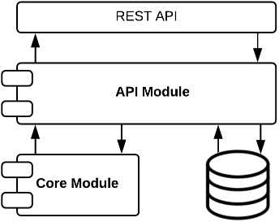
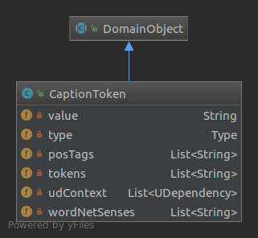
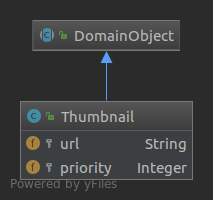
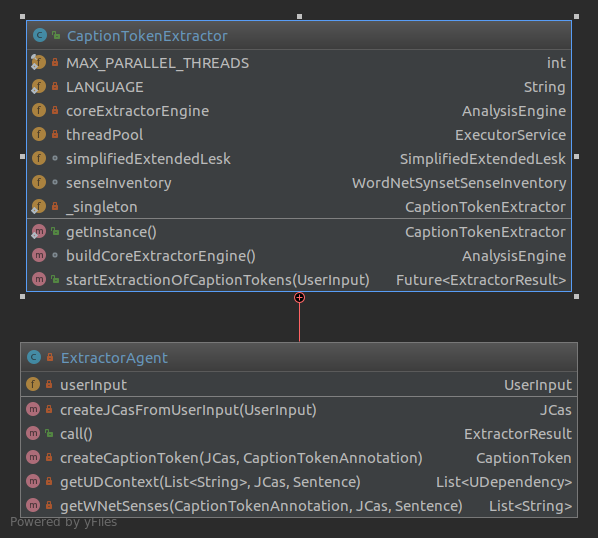

# Developer Guide
This guide will show you the basic architecture and most important components of the REST API to extend or build on it.

<!-- MarkdownTOC -->

- Software Architecure of the API
	- Core Module
		- Domain Package
		- CaptionTokenExtractor Package
			- `CaptionTokenExtractor`
			- Custom `Annotators`
			- Custom `Annotations`
		- ThumbnailCrawler Package
			- `ThumbnailCrawler`
	- DB Module
		- Redis Configuration
		- Subpackages
	- API Module
		- Components
- REST API Documentation

<!-- /MarkdownTOC -->

## Software Architecure of the API
The software is written in Java 8 using several Java Frameworks such as <b>[UIMA](https://uima.apache.org)</b> wrapped by <b>[DKPro Core](https://dkpro.github.io/dkpro-core/)</b>, <b>[DKPro WSD](https://dkpro.github.io/dkpro-wsd/)</b> and <b>[Spring-Boot](https://spring.io/projects/spring-boot)</b> and is structured a multi-module <b>[Maven](https://maven.apache.org)</b> project. The parent module pom.xml holds the basic configuration, properties, plugins and dependencies which are required in all of the three modules and is located in the `thumbnailAnnotator.parent` directory. This is the entry directory for the whole project, holds the three main modules and should be imported as a <b>[Maven](https://maven.apache.org)</b> project from the IDE of your choice. A diagram of how the modules interact is shown below.

### Core Module
This module holds the business logic as well as the domain model. The module is further devided into multiple packages:

#### Domain Package
This package holds the domain model. All of the POJO classes in this package inherit from the class `DomainObject`, to indicate that they are part of the domain model. The main components of the model are the `CaptionToken`, the `Thumbnail`, the `ExtractorResult` and the `CrawlerResult`.

- A `CaptionToken` describes the constituents of an input text, for which `Thumbnail`s are searched / crawled. Those constituents are Nouns with or without modifiers/adjectives (e.g. 'bird' or 'distant hight mountains') and Named Entities such as Persons, Organizations and Locations (e.g. 'Siddartha', 'New York' or 'Microsoft'). A UML diagram of a `CaptionToken` can be seen below. The members of the `CaptionToken` get described by their names.

	

- A `Thumbnail` represents a visual description of a `CaptionToken` in form of a URL pointing to the image and a priority that indicates how good the `Thumbnail` describes the `CaptionToken`. The priority of a `Thumbnail` is initialized with '1' and can be incremented or decremented by Users through the API later on.

	

- A `ExtractorResult` is the result of the `CaptionTokenExtractor` and bundles all `CaptionToken`s that were extracted from a `UserInput`. More details are described in the section of the `CaptionTokenExtractor`.

- A `CrawlerResult` is the result of the `ThumbnailCrawler` which holds a `CaptionToken` and a list of `Thumbnail`s that were crawled for this particular `CaptionToken`. More details are described in the section of the `ThumbnailCrawler`.

#### CaptionTokenExtractor Package
##### `CaptionTokenExtractor`
This package contains the `CaptionTokenExtractor` - the main component to extract `CaptionToken`s from a `UserInput`. It is designed as a Singleton class and it's core functionallity is implemented using the `UIMA Framework` wrapped by the `DKPro Core Framework` and `DKPro WSD`. The `CaptionTokenExtractor` contains a managed `ExecutorService` since the extraction happens in parallel. For each `UserInput` an `ExtractorAgent` gets instantiated, which extracts the `CaptionToken`s.

To extract `CaptionTokens`, an `AggregatedAnalysisEngine` is used to create `CaptionTokenAnnotations` which are then transformed to `CaptionTokens`. This `AggregatedAnalysisEngine` consits of the following `Annotators`, where the `Annotator`s 6. - 9. are a custom `Annotator`s. The `AggregatedAnalysisEngine` get's created in the `CaptionTokenExtractor`.

1. `OpenNlpSegmenter`
2. `ClearNlpPosTagger`
3. `ClearNlpLemmatizer`
4. `MaltParser`
5. `OpenNlpNamedEntityRecognizer` with variants 
	- location
	- person
	- organization
6. `PosExclusionFlagTokenAnnotator`
7. `NamedEntityCaptionTokenAnnotator`
8. `PosViewCreator`
9. `NounCaptionTokenAnnotator`

##### Custom `Annotators`
The following custom `Annotator`s can be found in the `nlp.floschne.thumbnailAnnotator.core.captionTokenExtractor.annotator` package.

- `PosExclusionFlagTokenAnnotator`
	- `Annotator` to create the `PosExclusionFlagToken`s for every `POS`-Tag from the `Segmenter` and initialized as not used.
- `NamedEntityCaptionTokenAnnotator`
	- `Annotator` to create `CaptionToken`s that hold Named Entities. It sets the  exclusion flags of the `PosExclusionFlagToken`s, which are covered by the created `CaptionToken`s, to true so that they're excluded later on, when creating the `CaptionToken`s that hold Nouns.
- `PosViewCreator`
	- `Annotator` that doesn't create `Annotations` but a `JCas` View that holds the `POS`-Tag values of the `Token`s. E.g. only 'JJ PUNCT JJ NNS' for 'blue, pale birds'.
- `NounCaptionTokenAnnotator`
	- `Annotator` to create `CaptionToken`s that hold Nouns.

##### Custom `Annotations`
This `Annotations` are described by XML files located at `src/main/resources/desc.type` and are generated by the <b>JCasGen Maven Plugin</b> during the generation phase of [Maven](https://maven.apache.org).

- `PosExclusionFlagToken`
	- This is the same as a `POS` from a POS-Tagger but has a flag wether or not it should be excluded of not in order to create a `CaptionTokenAnnotation`.
- `ViewMappingToken`
	- A `Annotation` that holds the start and end position in another `JCas`View to map between the two Views. E.g. A `Token` with surface 'bird' in default View has start and end [4, 7]. In another View that holds only `POS`-Tag ('NN') it has start and end [2, 4]. The `ViewMappingToken` contains both start and end positions from the two Views.
- `CaptionTokenAnnotation`
	- This `Annotation` represents a `CaptionToken` at <b>[UIMA](https://uima.apache.org)</b> level. It holds all the information to create a `CaptionToken` at domain model level.

#### ThumbnailCrawler Package
##### `ThumbnailCrawler`
This package contains the `ThumbnailCrawler` - a Singleton class to search the `Thumbnail`s for a given `CaptionToken`. This is done pretty straightforward by quering a `IThumbnailsource` with a `CaptionToken`. In the current version there is only implementation of the interface - the `ShutterstockSource` - but additional implementations could be used very easy.
In order to receive a specified number of URLs to the images, the value of the `CaptionToken` is used as query parameter to make a HTTP GET request to the <b>[Shutterstock REST API](https://developers.shutterstock.com/)</b>. If the number of returned results is less than the specified, only the head/last Token of the `CaptionToken` is used since it holds the most general description. Then, for each of those URLs a `Thumbnail` get's instantiated and it's priority is initialized with '1'.
The `ThumbnailCrawler` contains a managed `ExecutorService` since of getting `Thumbnails` is done in parallel. For each `CaptionToken` a `CrawlerAgent` gets instantiated which performs the crawling for that `CaptionToken`. 

### DB Module
As the name suggests, in this module the database layer is implemented. The database used, is the famous NoSQL, in-memory database called <b>[Redis](https://redis.io/)</b>. The module uses the simple Key-Value-Store to store the `Entity`s by an Id of type `String`. To make things easy and accessible in the API module the Module heavily depends on the <b>[Spring-Boot Framework](https://spring.io/projects/spring-boot)</b>, specially the <b>Spring-Boot-Data-Redis Component</b>. This package has high code coverage since it's curcible for the overall functionallity of the API.

#### Redis Configuration
The connection to <b>[Redis](https://redis.io/)</b> is configured in the `RedisConfig`. There are two Spring profiles, that specify the connection when running the API locally or inside <b>[docker-compose](https://docs.docker.com/compose/)</b>.

#### Subpackages
The module has four subpackages:
- entity
	- This subpackage contains the `Entitiy` POJOs `ThumbnailEntity`, `CaptionTokenEntitiy` and `CrawlerResultEntity` which are the Entity/DTO representations of the respective `DomainObject`s from the domain model in the Core Module. Those POJOs are persisted in a [Redis](https://redis.io/) Key-Value-Store.
- mapper
	- This subpackage contains the `IMapper` extensions to map between the `Entitiy` and `DomainObject` POJOs. The implementation of the interfaces in here get generated during the build phase of [Maven](https://maven.apache.org) by the <b>[MapStruct Code Generator](http://mapstruct.org/)</b>.
- repository
 	- This subpackage contains the `CURDRepository` interfaces used to store and receive the respective `Entities` from the `entitiy` package.
- service
	- This subpackage holds the `DBService`, which is a `@Service` class that wraps, extends and eases access to the repositories. This is mostly used in the API Module. Since the 
 
### API Module
This module is responsible to expose the REST API Resources to work with the <b>Thumbnail Annotator</b>. It connects the domain model functionallity of the Core Module with the DB Module. Since this package should hold as less logic as possible there are only three classes.
The module also heavily depends on the <b>[Spring-Boot Framework](https://spring.io/projects/spring-boot)</b>, specially the <b>Spring-Boot-Starter-Web Component</b>.
#### Components
- `Application`
	- This is the class with the only main-function of the wholeand therefore the main entry point. Since it's a `SpringBootApplication` it loads the `APIController` class in the Context and exposed the resources with an internal TomCat-Server.

- `APIController`
	- This is the main component of the API and specifies and exposes the API Resources. Since the code is very well documented, please have a look at it to get more details.

- `SwaggerConfig`
	-This class configures the Swagger-UI

## REST API Documentation
The RESTful API is documented by a <b>[Swagger-UI](https://swagger.io/tools/swagger-ui/)</b> implemented with  <b>[Springfox](https://github.com/springfox/springfox)</b> which can be found when opening [localhost:8081](localhost:8081) in a browser (assuming the API is running!). A screen shot of the header as well as the methods part of the [Swagger-UI](https://swagger.io/tools/swagger-ui/) can be seen below.

